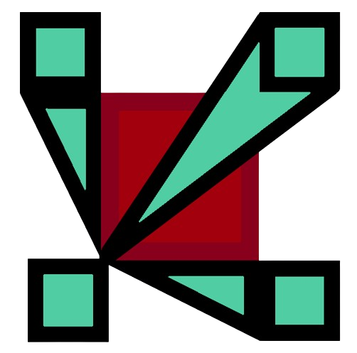

# Team Dole of Doves
# OHS Labor Day Hackathon Submission
## What is the issue?
All around the world, every day, OHS students join their Adobe Connect classes. While they are normally enjoyable and go smoothly, technical difficulties can lead to the computer world freezing or the sudden loss of the ability of speech. Our team strives to create software that finds solutions to these issues. 
## The solution
Upon loading https://doleofdoves.streamlit.app (which hosts the code in this repository), a user will find themselves in the section labeled SAVE ME, which is where a user can share their problems with an AI to find out what might be the issue. The AI will give helpful feedback and eventually decide the problem, and give a link to one of the hardware tests. If all else fails, the AI will provide a link to the stanford ohs techpage.
## The implementation
We have several different hardware tests. First, we have a microphone test, where a user can see a bar that marks how loud their microphone is. Next, there is a camera test, where one can make sure their hopefully smiling faces are visible. After that, there is a speaker test, where an amusing Rick Roll will be played to make sure that a person's speaker is working. Finally, we show part of fast.com, so one can check if their bandwidth is too low.
We look forward to you trying out our website!
**A big thanks from Team Dole of Doves**